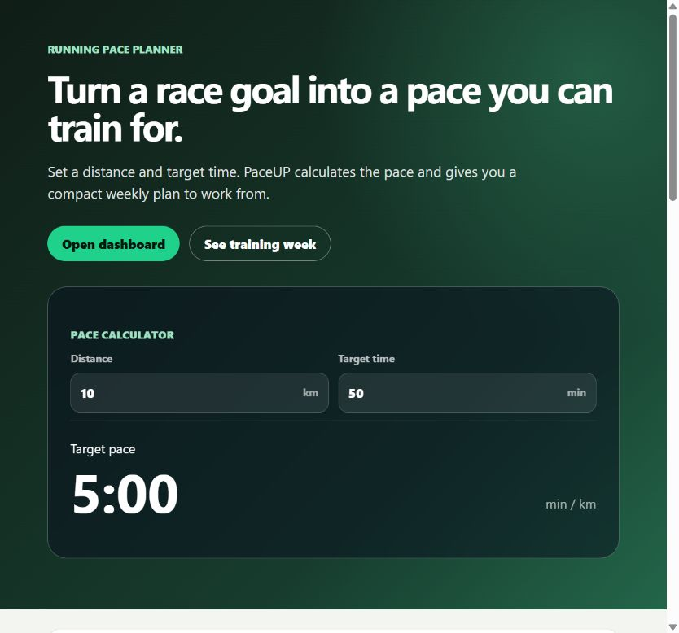

# PaceUP

PaceUP is a focused running pace planner. It converts a race distance and target time into a practical pace, shows a 5K estimate and presents a compact example training week.

[Live application](https://milekv.github.io/PaceUP/)



## Current scope

- Interactive distance and target time inputs
- Pace calculation in minutes per kilometre
- Estimated 5K finish time
- Responsive weekly training overview
- Keyboard friendly controls and reduced layout density on mobile
- Unit tests for calculation and formatting edge cases

The repository currently represents an early frontend MVP. Accounts, activity history, live GPS tracking and social features are not implemented.

## Stack

- React 19
- TypeScript
- Vite
- ESLint
- Node.js test runner
- GitHub Actions and GitHub Pages

## Local development

Requires Node.js 22.6 or newer.

```bash
npm ci
npm run dev
```

Quality checks:

```bash
npm run typecheck
npm run lint
npm test
npm run build
```

## Project structure

```text
src/
  components/   Reusable interface components
  lib/          Pace calculations and tests
  styles/       Responsive application styles
  App.tsx       Calculator and training week
```

## Status

Active early-stage project. The next useful step is persisting multiple race goals and letting runners build their own weekly sessions.

## License

[MIT](LICENSE)
