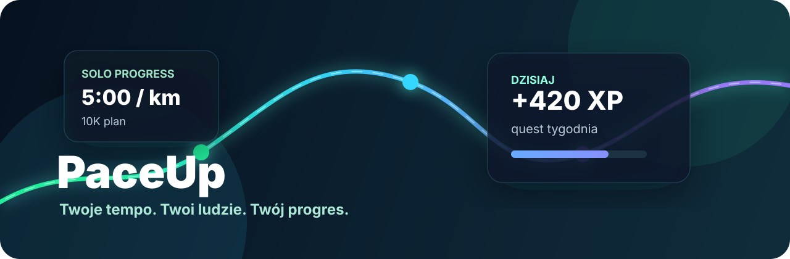
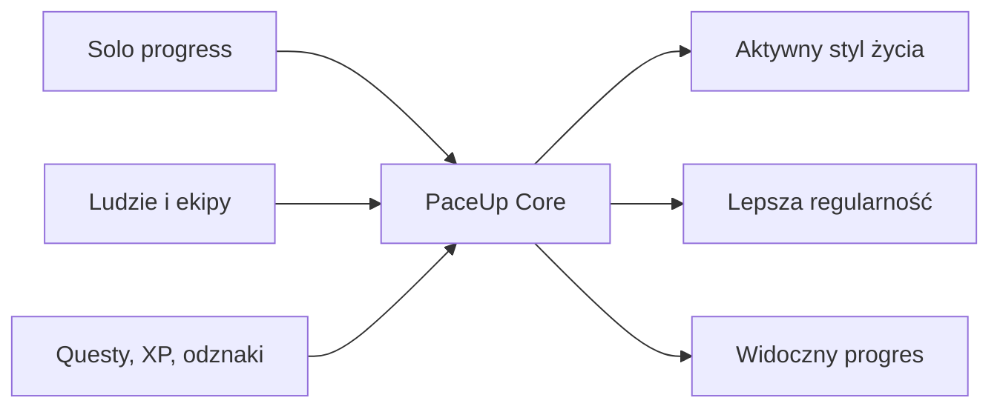

<p align="center">
  
</p>

<h1 align="center">PaceUp</h1>

<p align="center">
  <strong>Twoje tempo. Twoi ludzie. Twój progres.</strong>
</p>

<p align="center">
  
</p>

<p align="center">
  <a href="https://github.com/milekv/PaceUP/actions/workflows/ci.yml">
    
  </a>
  
  
  
  
</p>

---

## Overview

**PaceUp** to aplikacja społecznościowo-treningowa dla aktywnych ludzi. Jej główna idea jest prosta: pomóc użytkownikowi budować aktywny styl życia samodzielnie albo razem z innymi.

To nie ma być kopia Stravy ani tylko licznik kilometrów. PaceUp ma dawać wartość nawet wtedy, gdy użytkownik jest sam: może zrobić aktywność solo, zdobyć XP, realizować plan, odblokować odznaki, analizować progres i dopiero później dołączać do ekip, wydarzeń albo aktywności grupowych.

> Obecny kod repozytorium to profesjonalny frontend starter / MVP foundation. Pełna warstwa social, questów, backendu i analityki jest opisana jako kierunek rozwoju, a nie udawana jako gotowa produkcja.

## Live

```text
https://milekv.github.io/PaceUP/
```

GitHub Pages jest przygotowany przez workflow `Deploy GitHub Pages`. Jeśli strona nie jest jeszcze widoczna, trzeba włączyć `Settings -> Pages -> Source: GitHub Actions`.

## Co Już Jest W Repo

| Obszar | Status | Szczegóły |
| --- | --- | --- |
| Frontend starter | Gotowe | React, TypeScript, Vite, ESLint |
| Dashboard preview | Gotowe | Hero, metryki, target pace, tygodniowy wolumen |
| Logika tempa | Gotowe | `pacePerKilometer`, `formatPace` |
| CI | Gotowe | typecheck, lint, build |
| GitHub Pages deploy | Gotowe technicznie | workflow z artifactem `dist` |
| Dokumentacja projektu | Gotowe | architecture, product brief, roadmap, ADR |
| Social features | Planowane | aktywności grupowe, ekipy, czat, check-in |
| Backend / Supabase | Planowane | service layer, auth, RLS, migracje |

## Key Features

### Solo Progress

- start aktywności solo,
- zapis czasu, dystansu, tempa i notatki,
- XP za aktywność,
- mood / samopoczucie po treningu,
- historia aktywności,
- progres bez potrzeby czekania na innych użytkowników.

### Aktywności Grupowe

- tworzenie aktywności,
- dołączanie do treningów i wydarzeń,
- szczegóły aktywności,
- status aktywności,
- check-in,
- czat dla uczestników.

### Questy I Gamifikacja

- XP,
- poziomy,
- questy dzienne i tygodniowe,
- questy eventowe,
- odznaki,
- rarity,
- level-up modal,
- animacje nagród.

### Plany Treningowe

- plany biegowe,
- plany siłowe,
- plany zdrowia i regularnego ruchu,
- dzienny trening do wykonania,
- progres planu,
- XP i odznaki za konsekwencję.

### Lokalne Wydarzenia I Ekipy

- lokalne wydarzenia sportowe,
- race mode,
- przygotowanie do zawodów,
- ekipy pod wspólny cel,
- statystyki ekip,
- aktywności social, np. kawa, spacer, lekki ruch.

## Product Concept

PaceUp łączy trzy warstwy:



Produkt ma działać w dwóch trybach:

- **Solo-first** - użytkownik ma wartość od pierwszego dnia, nawet bez znajomych w aplikacji.
- **Social-ready** - gdy pojawiają się inni ludzie, dochodzą aktywności grupowe, ekipy, eventy i wspólne cele.

## Tech Stack

Realny stack z `package.json`:

- **React 19**
- **TypeScript 5**
- **Vite 6**
- **lucide-react**
- **ESLint 9**
- **GitHub Actions**
- **GitHub Pages**

Nie ma jeszcze w kodzie:

- Tailwind CSS,
- Framer Motion,
- Supabase client,
- migracji bazy danych,
- testów automatycznych,
- PWA / Capacitor.

Te elementy są dobrymi kandydatami na kolejne etapy.

## Project Structure

```text
.
|-- .github/
|   |-- ISSUE_TEMPLATE/
|   `-- workflows/
|-- assets/
|   `-- paceup-readme-banner.svg
|-- docs/
|   |-- adr/
|   |-- ARCHITECTURE.md
|   |-- PRODUCT_BRIEF.md
|   `-- ROADMAP.md
|-- src/
|   |-- components/
|   |   `-- MetricCard.tsx
|   |-- lib/
|   |   `-- pace.ts
|   |-- styles/
|   |   `-- global.css
|   |-- App.tsx
|   `-- main.tsx
|-- CONTRIBUTING.md
|-- SECURITY.md
|-- package.json
`-- vite.config.ts
```

## Main Screens

Obecnie w kodzie istnieje jeden główny ekran startowy:

- hero z komunikatem produktu,
- panel target pace dla celu 10K,
- karty metryk: tempo, tygodniowy dystans, trening tempo, najbliższy plan,
- sekcja initial product scope.

Docelowe ekrany aplikacji:

- onboarding,
- logowanie i rejestracja,
- start / dashboard użytkownika,
- solo progress,
- aktywności grupowe,
- szczegóły aktywności,
- ekipy,
- wydarzenia,
- plany treningowe,
- dziennik aktywności,
- analityka,
- profil,
- ustawienia.

## Activity Types

Docelowo PaceUp rozróżnia dane w zależności od typu aktywności:

| Typ | Dane |
| --- | --- |
| Bieganie | dystans, czas, tempo |
| Spacer | czas, opcjonalny dystans |
| Rower | dystans, czas, średnia prędkość |
| Trekking | dystans, czas, przewyższenia, trudność |
| Siłownia | ćwiczenia, serie, powtórzenia, ciężar, RPE, objętość |
| Social / kawa | miejsce, godzina, opis, liczba osób |

## Gamification System

System gamifikacji jest planowaną osią produktu:

- XP za aktywności,
- poziomy użytkownika,
- streak / seria,
- questy dzienne, tygodniowe, eventowe i solo,
- odznaki za konsekwencję,
- rarity odznak,
- level-up modal,
- animacje nagród.

## Training Plans & Analytics

Docelowa analityka:

- tygodniowe i miesięczne statystyki,
- liczba kilometrów,
- minuty ruchu,
- treningi siłowe,
- objętość treningowa,
- XP,
- seria,
- ulubiony typ aktywności,
- progres planu,
- porównanie target pace vs realne tempo.

## Backend / Data Layer

Projekt jest przygotowywany pod przyszłą warstwę danych, ale obecnie nie zawiera jeszcze produkcyjnego backendu.

Planowana architektura:

- **mock mode** dla szybkiego prototypowania,
- **Supabase / Bolt Database mode** dla danych produkcyjnych,
- service layer oddzielający UI od bazy,
- typy bazodanowe,
- migracje,
- RLS policies,
- env variables przez `.env.example`.

## Getting Started

Wymagania:

- Node.js `>=20.19.0`
- npm

Instalacja:

```bash
npm install
```

Development:

```bash
npm run dev
```

Build produkcyjny:

```bash
npm run build
```

Quality checks:

```bash
npm run typecheck
npm run lint
```

Preview buildu:

```bash
npm run preview
```

## Environment Variables

Aktualny plik `.env.example`:

```env
VITE_APP_NAME=PaceUP
```

Planowane zmienne dla backendu:

```env
VITE_SUPABASE_URL=
VITE_SUPABASE_ANON_KEY=
VITE_DATA_MODE=mock
```

## Current Status

PaceUp jest w fazie aktywnego rozwoju.

Aktualnie gotowe:

- frontend foundation,
- podstawowy ekran landing/dashboard,
- logika obliczania tempa,
- dokumentacja repo,
- CI,
- GitHub Pages workflow.

W trakcie / planowane:

- auth,
- onboarding,
- profil użytkownika,
- aktywności solo,
- aktywności grupowe,
- questy,
- XP i poziomy,
- odznaki,
- ekipy,
- wydarzenia lokalne,
- Supabase/Bolt Database,
- RLS policies,
- testy QA.

## Roadmap

- [ ] Pełny dashboard użytkownika
- [ ] Solo activity flow
- [ ] Formularze dla różnych typów aktywności
- [ ] Trening siłowy z objętością
- [ ] Questy i XP
- [ ] Odznaki i level-up modal
- [ ] Ekipy i aktywności grupowe
- [ ] GPS tracking
- [ ] Mapa trasy
- [ ] Integracja Supabase / Bolt Database
- [ ] PWA
- [ ] Aplikacja mobilna przez Capacitor
- [ ] Testy QA
- [ ] Performance optimization

## License

MIT License. Zobacz [LICENSE](LICENSE).

---

<p align="center">
  <strong>PaceUp</strong> - aktywność bez presji, progres bez chaosu.
</p>
