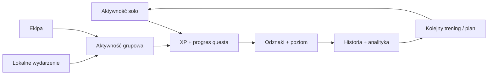

<p align="center">
  
</p>

<h1 align="center">PaceUp</h1>

<p align="center">
  <strong>Twoje tempo. Twoi ludzie. Twój progres.</strong>
</p>

<p align="center">
  
</p>

<p align="center">
  <a href="https://pace-up.bolt.host/">
    
  </a>
  <a href="https://github.com/milekv/PaceUP/actions/workflows/ci.yml">
    
  </a>
  
  
  
  
</p>

---

## O Projekcie

**PaceUp** to aplikacja społecznościowo-treningowa dla aktywnych ludzi. Łączy aktywność solo, aktywności grupowe, questy, XP, odznaki, plany treningowe, lokalne wydarzenia sportowe i analitykę postępów w jednym mobile-first doświadczeniu.

PaceUp nie jest kolejną kopią Stravy ani samym licznikiem kilometrów. Produkt ma działać nawet wtedy, gdy użytkownik dopiero zaczyna i nie ma jeszcze społeczności w okolicy: może wykonać trening solo, zdobyć XP, ukończyć quest, realizować plan, prowadzić dziennik aktywności i obserwować progres. Warstwa społecznościowa rozwija ten fundament przez ekipy, aktywności grupowe i wydarzenia.

**Live app:** [pace-up.bolt.host](https://pace-up.bolt.host/)

## Filozofia Produktu

PaceUp opiera się na dwóch trybach, które wzajemnie się uzupełniają:

- **Progres solo** - użytkownik może trenować sam, realizować plany, zdobywać XP, odblokowywać odznaki i śledzić regularność.
- **Aktywności społeczne** - użytkownik może tworzyć aktywności, dołączać do innych, budować ekipy i przygotowywać się do lokalnych wydarzeń sportowych.

Główna zasada produktu: aplikacja musi dawać wartość od pierwszego dnia, nawet bez dużej społeczności. Społeczność jest wzmocnieniem progresu, nie warunkiem używania aplikacji.



## Funkcje

### Logowanie i Onboarding

- logowanie i rejestracja,
- onboarding nowego użytkownika,
- profil użytkownika,
- preferencje aktywności,
- przygotowanie pod tryb Supabase/Bolt Database.

### Ekran Startowy

- poziom użytkownika,
- XP i progres do kolejnego poziomu,
- streak / regularność,
- szybkie akcje,
- plan dnia,
- aktywny plan treningowy,
- quest tygodnia,
- feed społecznościowy.

### Progres Solo

- aktywności solo,
- zakończenie aktywności z podsumowaniem,
- mood / samopoczucie,
- notatki,
- XP za ukończenie,
- zapis do historii,
- aktualizacja questów i analityki.

### Aktywności Grupowe

- tworzenie aktywności,
- dołączanie do aktywności,
- szczegóły wydarzenia,
- check-in,
- status aktywności,
- czat aktywności,
- progres społecznościowy.

### Typy Aktywności

PaceUp nie traktuje każdego ruchu tak samo. Dane są dopasowane do typu aktywności.

| Typ aktywności | Dane | Uwagi |
| --- | --- | --- |
| Bieganie | dystans, czas, tempo, mood, notatki | Podstawowy typ dla planów biegowych |
| Spacer | czas, opcjonalny dystans, mood, notatki | Niski próg wejścia dla regularności |
| Rower | dystans, czas, średnia prędkość, mood, notatki | Osobne metryki względem biegania |
| Trekking | dystans, czas, przewyższenia, trudność, mood | Aktywność outdoorowa |
| Siłownia | typ treningu, partie, ćwiczenia, serie, powtórzenia, ciężar, RPE, objętość | Bez kilometrów i tempa; liczy się objętość treningowa |
| Social / kawa | miejsce, godzina, opis, liczba osób | Aktywność społecznościowa bez presji sportowej |

### Trening Siłowy

Moduł siłowy jest traktowany jako osobny typ aktywności, a nie sztucznie dopasowany do kilometrów. PaceUp uwzględnia:

- typ treningu, np. FBW, upper/lower, push/pull/legs, cardio, custom,
- partie mięśniowe,
- ćwiczenia,
- serie,
- powtórzenia,
- ciężar,
- opcjonalne RPE,
- całkowitą objętość treningową.

### Plany Treningowe

PaceUp wspiera koncepcję planów treningowych w kilku kategoriach:

- **Bieganie** - First 5K, bieganie 3x w tygodniu, przygotowanie do 10K, powrót po przerwie.
- **Siła** - Beginner FBW, upper/lower split, push pull legs, trening siłowy dla biegaczy.
- **Zdrowie i ruch** - 20 minut ruchu dziennie, regularność tygodniowa, aktywny powrót.

Plan może zawierać opis, poziom trudności, czas trwania, liczbę treningów w tygodniu, listę jednostek, progres, nagrody XP i odznaki.

### Questy, XP i Odznaki

Gamifikacja jest jednym z głównych mechanizmów retencji:

- XP za aktywności,
- poziomy,
- questy dzienne, tygodniowe, eventowe i solo,
- odznaki,
- poziomy rzadkości,
- level-up modal,
- odblokowywanie odznak,
- progres questów,
- odporność na wielokrotne naliczanie XP dla tej samej akcji.

System jest przygotowany pod event-driven progress, np.:

- `solo_activity_completed`,
- `strength_workout_completed`,
- `plan_workout_completed`,
- `group_activity_completed`,
- `event_joined`,
- `team_joined`.

### Dziennik Aktywności

- historia aktywności,
- podsumowania ukończonych treningów,
- filtrowanie po typie aktywności,
- szczegóły treningu siłowego,
- dane zależne od typu aktywności,
- źródło aktywności, np. plan treningowy.

### Analityka

- liczba aktywności tygodniowo i miesięcznie,
- minuty ruchu,
- kilometry biegania, spaceru i roweru,
- treningi siłowe,
- objętość treningowa,
- XP,
- streak,
- ulubiony typ aktywności,
- progres aktywnego planu.

### Lokalne Wydarzenia i Race Mode

- lokalne wydarzenia sportowe,
- karty wydarzeń,
- race mode,
- grupy przygotowujące się do wydarzeń,
- questy powiązane z wydarzeniami.

Zaawansowane GPS tracking, live route tracking i mapa trasy są częścią roadmapy.

### Ekipy

- ekipy użytkowników,
- karty ekip,
- wspólne cele,
- progres zespołu,
- motywacja społecznościowa.

### Profil i Ustawienia

- avatar,
- poziom,
- XP,
- statystyki,
- odznaki,
- historia,
- analityka,
- ustawienia konta,
- prywatność,
- powiadomienia,
- bezpieczeństwo,
- wylogowanie.

### Warstwa Danych

Architektura projektu jest przygotowywana pod tryb danych oparty o Supabase/Bolt Database:

- service layer,
- mock mode,
- database mode,
- typy danych,
- migracje,
- Row Level Security,
- fallback dla stanu lokalnego w trybie mock.

## Ścieżka Użytkownika

```text
Rejestracja / logowanie
  -> Onboarding
  -> Ekran startowy
  -> Aktywność solo albo grupowa
  -> Zakończenie aktywności
  -> Nagroda XP
  -> Progres questa
  -> Odblokowanie odznaki
  -> Historia
  -> Analityka
  -> Kolejny trening / progres planu
```

## Wiarygodny Progres

PaceUp jest projektowany tak, żeby progres użytkownika był wiarygodny:

- unikalne `actionId` dla akcji nagradzanych XP,
- rejestr ukończonych akcji,
- ochrona przed wielokrotnym naliczaniem XP,
- event log XP,
- okresowe questy dzienne i tygodniowe,
- fallback w trybie mock/local state.

## Stack Technologiczny

Repozytorium jest zbudowane na:

- React 19
- TypeScript 5
- Vite 6
- lucide-react
- ESLint 9
- GitHub Actions

Kierunek rozwoju warstwy produktowej obejmuje:

- Supabase/Bolt Database,
- animacje w stylu Framer Motion,
- fallback mock/localStorage,
- warstwa serwisów gotowa pod backend.

## Struktura Repozytorium

```text
.
|-- .github/
|   |-- ISSUE_TEMPLATE/
|   `-- workflows/
|-- assets/
|   `-- paceup-readme-banner.svg
|-- docs/
|   |-- adr/
|   |-- ARCHITECTURE.md
|   |-- PRODUCT_BRIEF.md
|   `-- ROADMAP.md
|-- src/
|   |-- components/
|   |   `-- MetricCard.tsx
|   |-- lib/
|   |   `-- pace.ts
|   |-- styles/
|   |   `-- global.css
|   |-- App.tsx
|   `-- main.tsx
|-- CONTRIBUTING.md
|-- SECURITY.md
|-- package.json
`-- vite.config.ts
```

## Uruchomienie Lokalnie

Wymagania:

- Node.js `>=20.19.0`
- npm

Instalacja:

```bash
npm install
```

Tryb development:

```bash
npm run dev
```

Kontrola jakości:

```bash
npm run typecheck
npm run lint
```

Build produkcyjny:

```bash
npm run build
```

Podgląd buildu:

```bash
npm run preview
```

## Zmienne Środowiskowe

Publiczny plik `.env.example`:

```env
VITE_APP_NAME=PaceUP
```

Repozytorium nie zawiera sekretów ani prywatnych kluczy. Wartości produkcyjne są zarządzane poza kodem aplikacji.

## Status Projektu

PaceUp jest aktywnie rozwijanym MVP aplikacji sportowo-społecznościowej. Publiczny opis koncentruje się na kierunku produktu, najważniejszych modułach i jakości architektury.

### Obecny Zakres

- doświadczenie mobile-first,
- logowanie i onboarding,
- ekran startowy,
- aktywności solo i grupowe,
- typy aktywności,
- dane treningu siłowego,
- XP, questy i odznaki,
- historia i analityka,
- ekipy,
- lokalne wydarzenia,
- profil i ustawienia,
- koncepcje persystencji pod Supabase/Bolt.

### Rozwijane Obszary

- przenoszenie kolejnych danych do warstwy bazodanowej,
- stabilizacja synchronizacji profilu,
- wiarygodne naliczanie XP i progresu questów,
- QA mobile,
- stany błędów, puste stany i obsługa przypadków brzegowych.

### Kolejne Kierunki

- GPS tracking,
- live route tracking,
- mapa trasy po treningu,
- richer race mode,
- offline-first sync,
- powiadomienia push,
- PWA support,
- Capacitor mobile wrapper,
- automatyczne testy,
- monitoring produkcyjny,
- panel administracyjny i moderacja.

## Roadmapa

### Etap 1 - Stabilizacja Produktu

- QA wszystkich głównych flow,
- audyt przycisków i akcji,
- stabilizacja synchronizacji profilu,
- puste stany, loadingi i błędy,
- performance pass na mobile.

### Etap 2 - GPS i Mapy

- geolokalizacja,
- tracking aktywności na żywo,
- pause/resume,
- podsumowanie trasy,
- mapa po treningu.

### Etap 3 - Mobile Release

- PWA support,
- Capacitor wrapper,
- Android build,
- iOS build,
- ikony aplikacji,
- splash screeny.

### Etap 4 - Social i Eventy

- real-time chat,
- grupy eventowe,
- publiczne ekipy,
- narzędzia moderacji,
- bezpieczniejsze flow społecznościowe.

### Etap 5 - Produkcyjny Backend

- pełna persystencja w bazie,
- dopracowanie RLS policies,
- offline sync,
- powiadomienia push,
- monitoring,
- analityka produktowa.

## Materiały Wizualne

Screenshoty i product walkthrough będą uzupełniane wraz z rozwojem interfejsu.

## Licencja

MIT License. Zobacz [LICENSE](LICENSE).

---

<p align="center">
  <strong>PaceUp</strong> - aktywność bez presji, progres bez chaosu.
</p>
